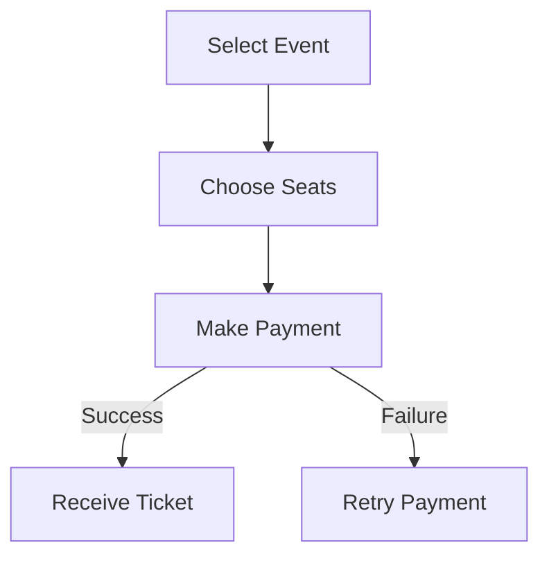
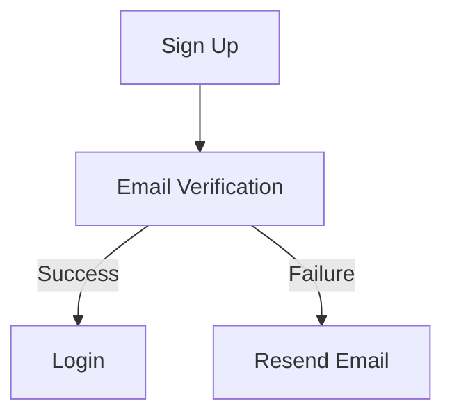

#Activity Workflow Modeling with Activity Diagrams

## **Booking a Ticket Workflow**

**Explanation:**
- Users select an event, pick seats, and make payment.
- A successful payment issues a ticket, while a failure prompts retry options.

## **User Registration Workflow**

**Explanation:**
- Users must verify their email before logging in.
- Failed verifications trigger email resend options.

---
