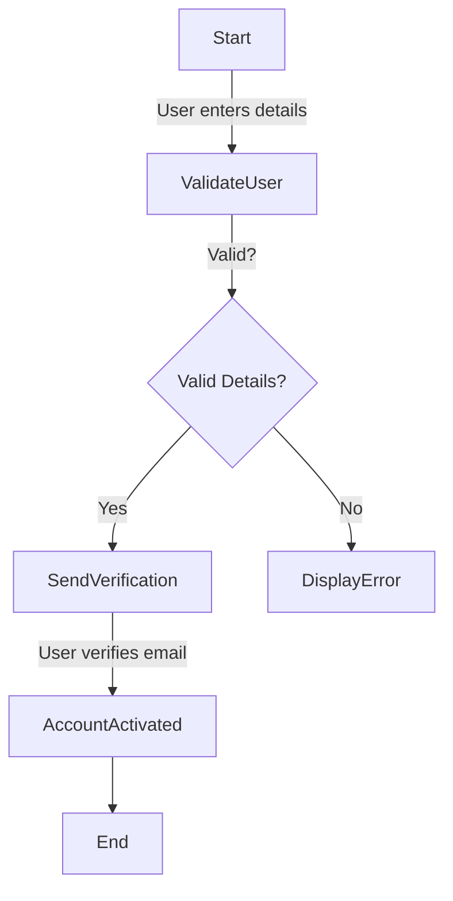
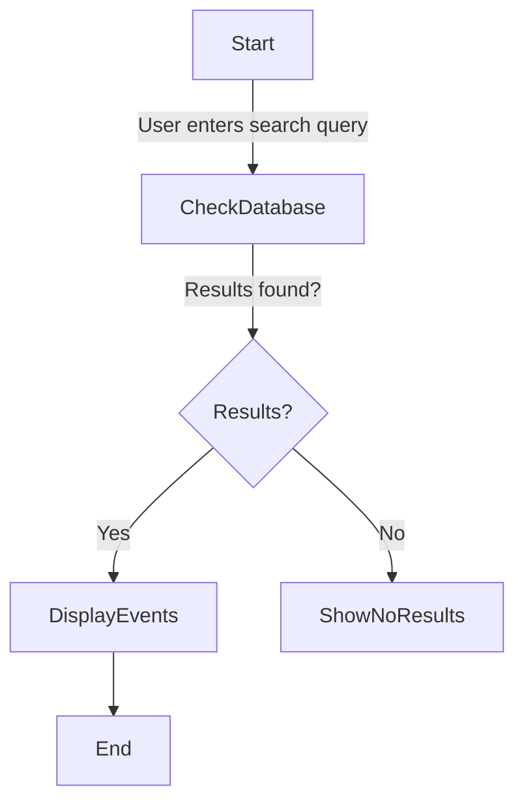
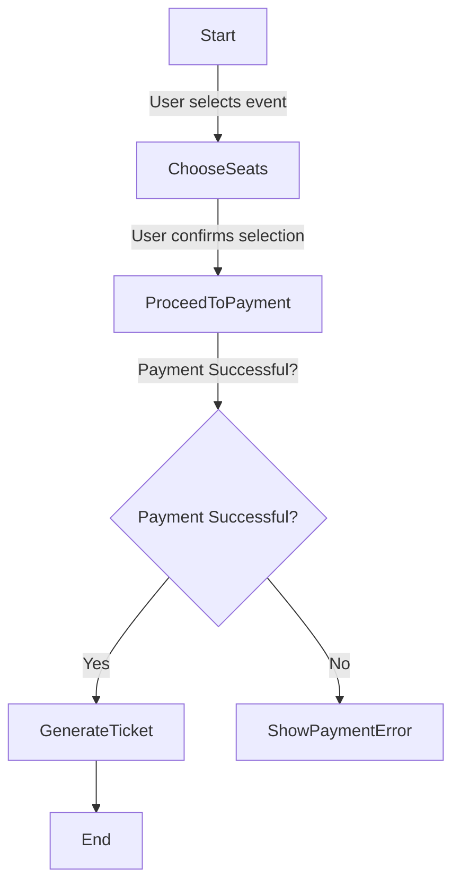
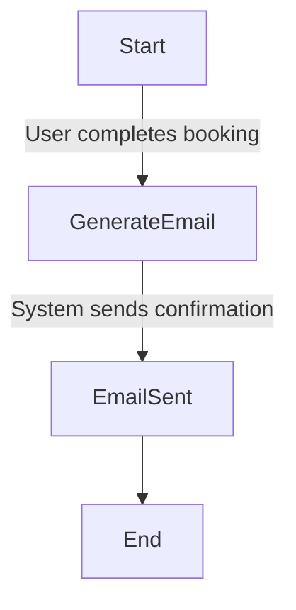
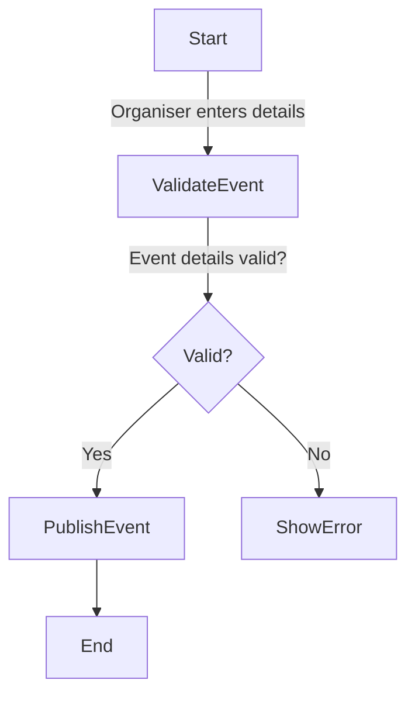
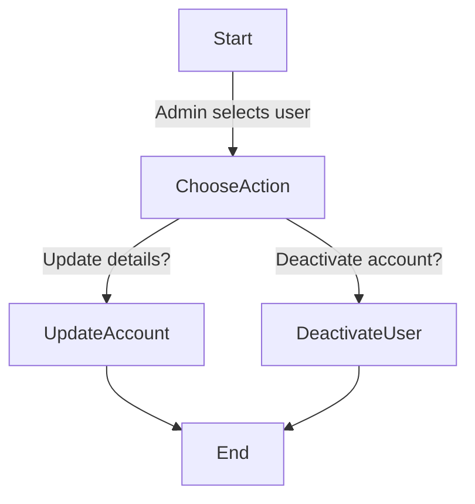
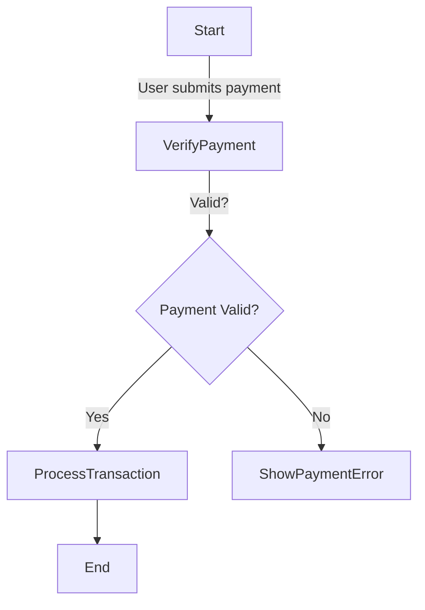
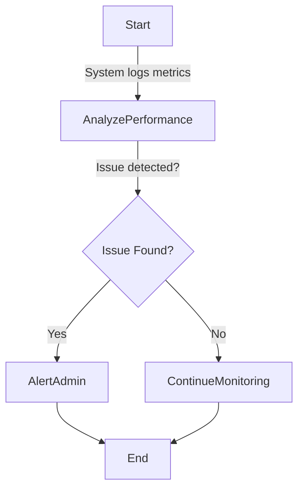

# Activity Workflow Modeling

## 1. User Registration
### Activity Diagram

### Explanation
- **Actors**: User, System
- **Steps**: User enters details, system validates, sends email verification, activates account.
- **Stakeholder Impact**: Ensures only verified users can book events.

---

## 2. Search for Events
### Activity Diagram

### Explanation
- **Actors**: User, System
- **Steps**: Search event database and display results.
- **Stakeholder Impact**: Enhances user experience with efficient search.

---

## 3. Book a Ticket
### Activity Diagram

### Explanation
- **Actors**: User, Payment System
- **Steps**: User selects seats, completes payment, receives ticket.
- **Stakeholder Impact**: Secure and seamless booking process.

---

## 4. Receive Booking Confirmation
### Activity Diagram

### Explanation
- **Actors**: System, User
- **Steps**: Booking confirmation email is sent after successful payment.
- **Stakeholder Impact**: Provides proof of purchase for users.

---

## 5. Create a New Event
### Activity Diagram

### Explanation
- **Actors**: Event Organiser, System
- **Steps**: Organisers submit event details, system validates, publishes event.
- **Stakeholder Impact**: Ensures only complete and valid events are published.

---

## 6. Manage User Accounts
### Activity Diagram

### Explanation
- **Actors**: Admin
- **Steps**: Admin can update or deactivate user accounts.
- **Stakeholder Impact**: Enhances system control and security.

---

## 7. Process Payments and Refunds
### Activity Diagram

### Explanation
- **Actors**: User, Payment System
- **Steps**: Payment is verified and processed, or an error is shown.
- **Stakeholder Impact**: Secure transactions reduce fraud risk.

---

## 8. Monitor System Performance
### Activity Diagram

### Explanation
- **Actors**: System, Admin
- **Steps**: System monitors performance, detects issues, alerts admin.
- **Stakeholder Impact**: Ensures system reliability and uptime.

---
