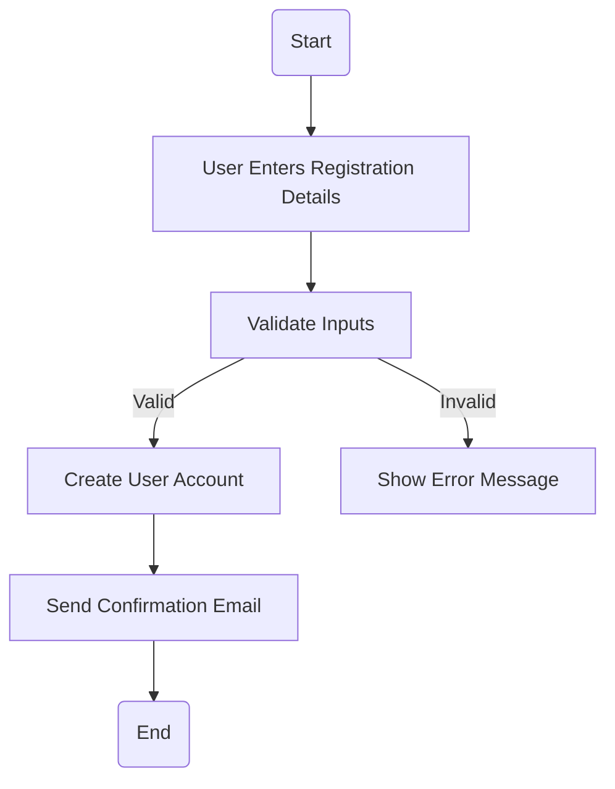
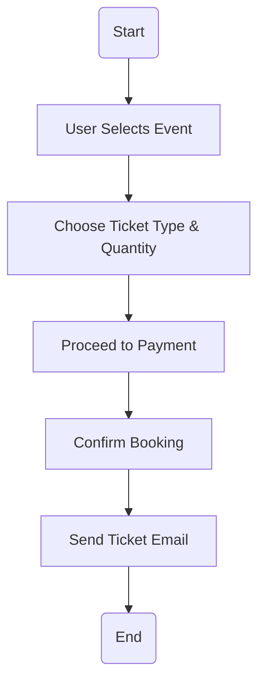
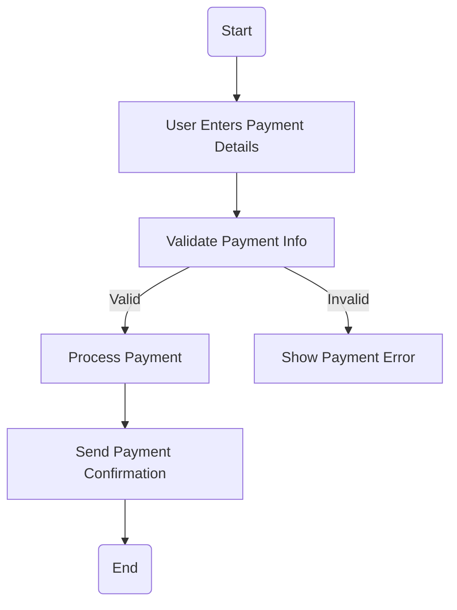
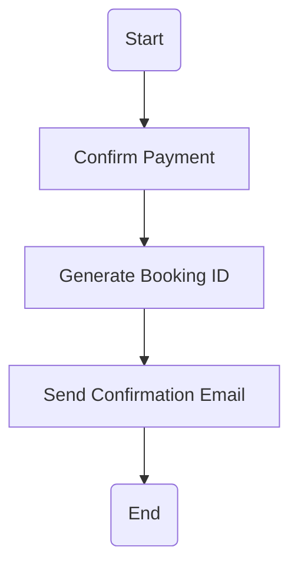
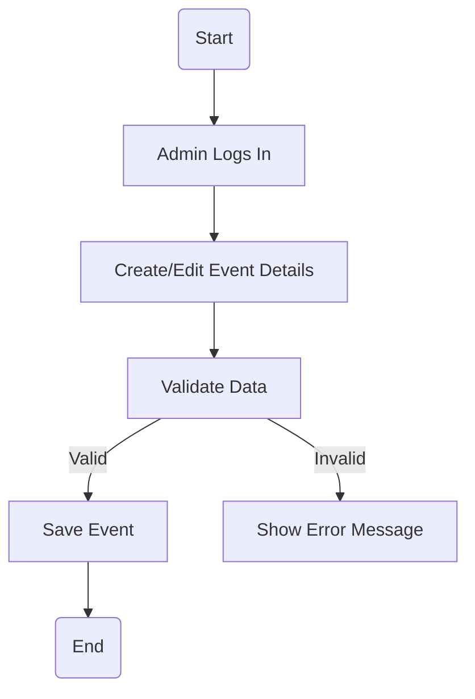
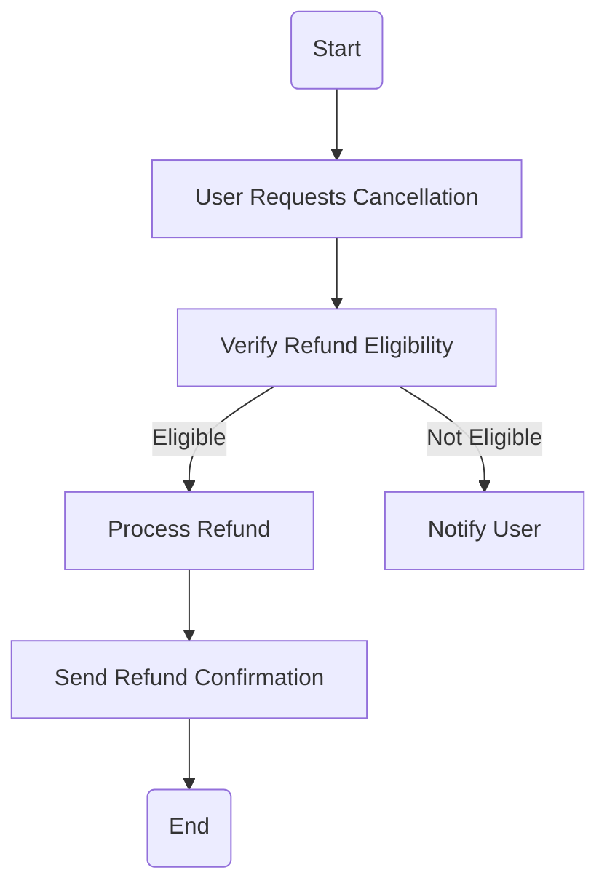
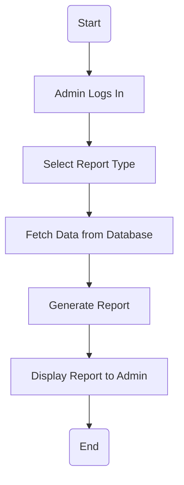
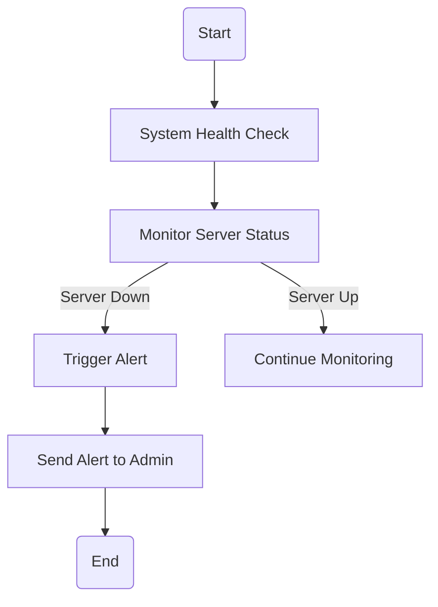

# Activity Workflow Modeling

This document contains **UML activity diagrams** for eight key workflows in the system, along with explanations of their process flows, decisions, and parallel actions.

## 1. User Registration

### Explanation
- Ensures user inputs are validated before account creation.
- Sends a confirmation email upon successful registration.
- Addresses stakeholder concerns about security and usability.

---

## 2. Booking an Event Ticket

### Explanation
- Ensures smooth booking flow.
- Users must confirm details before payment.
- Automated email reduces manual work.

---

## 3. Payment Processing

### Explanation
- Ensures security and validation before processing payments.
- Directly aligns with user concerns about failed transactions.

---

## 4. Sending Booking Confirmation

### Explanation
- Ensures customers receive instant booking confirmation.
- Automated emails prevent manual errors.

---

## 5. Managing Event Details (Create/Edit)

### Explanation
- Ensures event details are accurate before saving.
- Admins can edit details if needed.

---

## 6. Handling Cancellations and Refunds

### Explanation
- Ensures cancellations follow business rules.
- Refund processing reduces user complaints.

---

## 7. Viewing Ticket Sales Reports

### Explanation
- Ensures admin access to critical sales data.
- Helps event organizers make data-driven decisions.

---

## 8. Monitoring System Uptime

### Explanation
- Ensures real-time monitoring of system performance.
- Alerts admins to downtime issues immediately.

---
