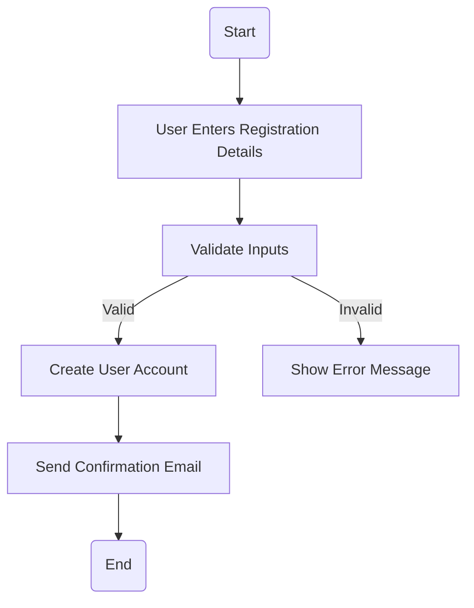
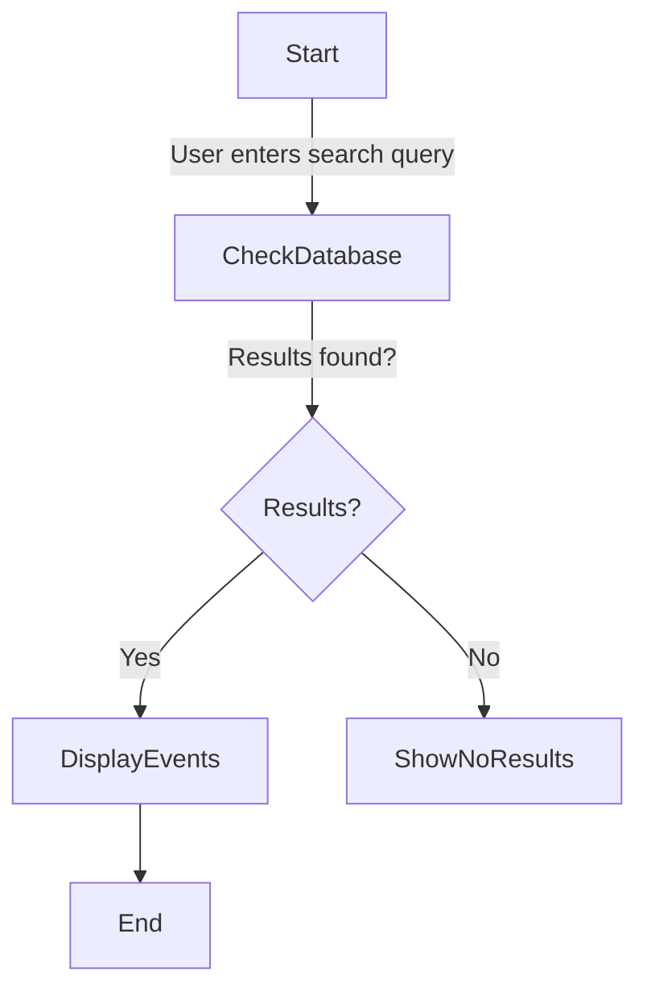
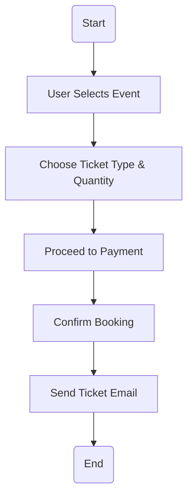
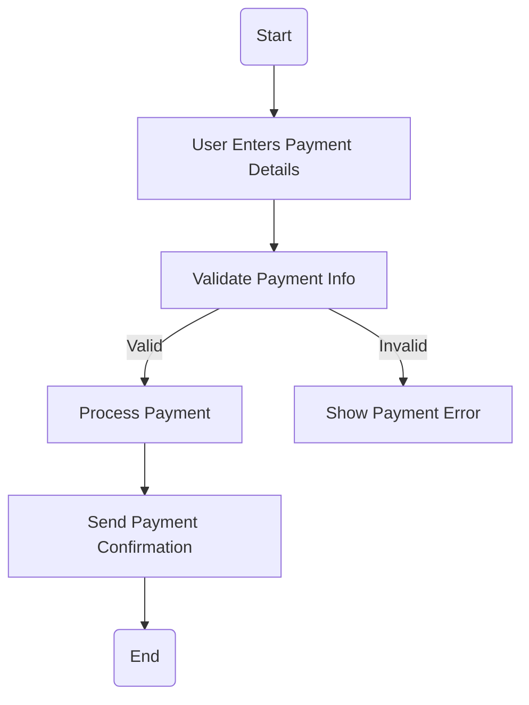
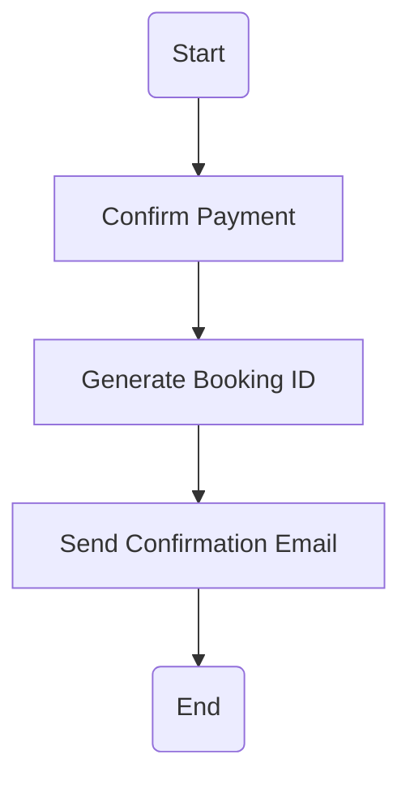
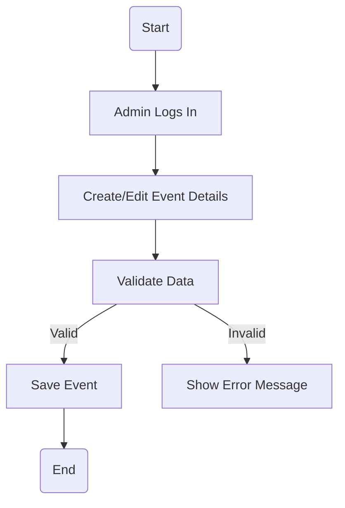
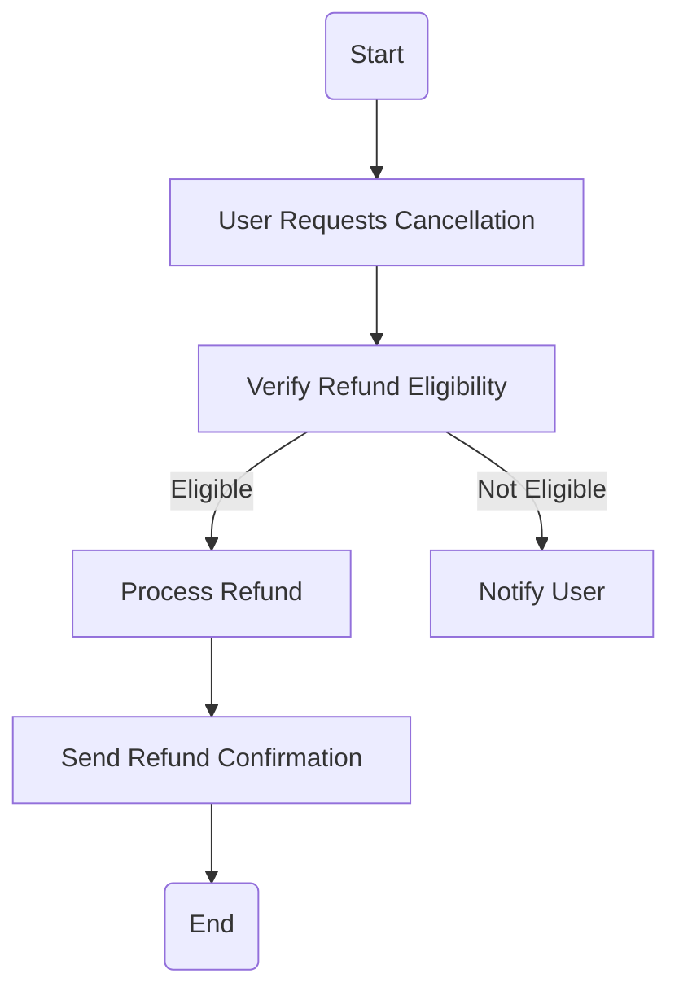
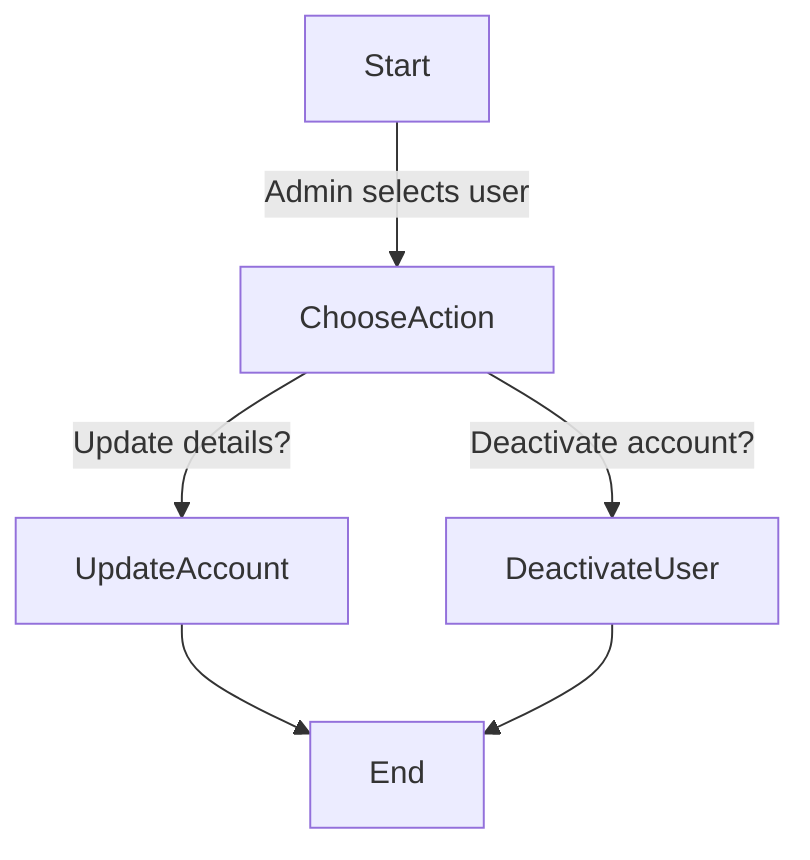
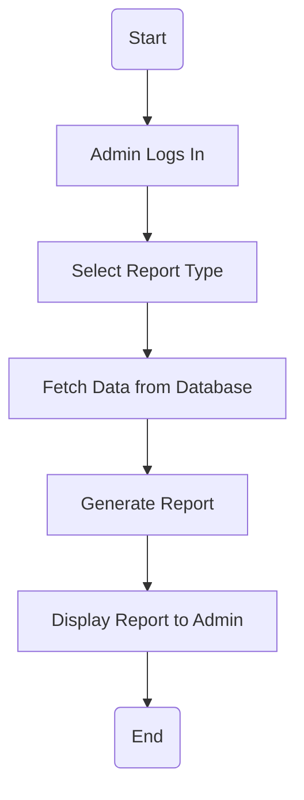
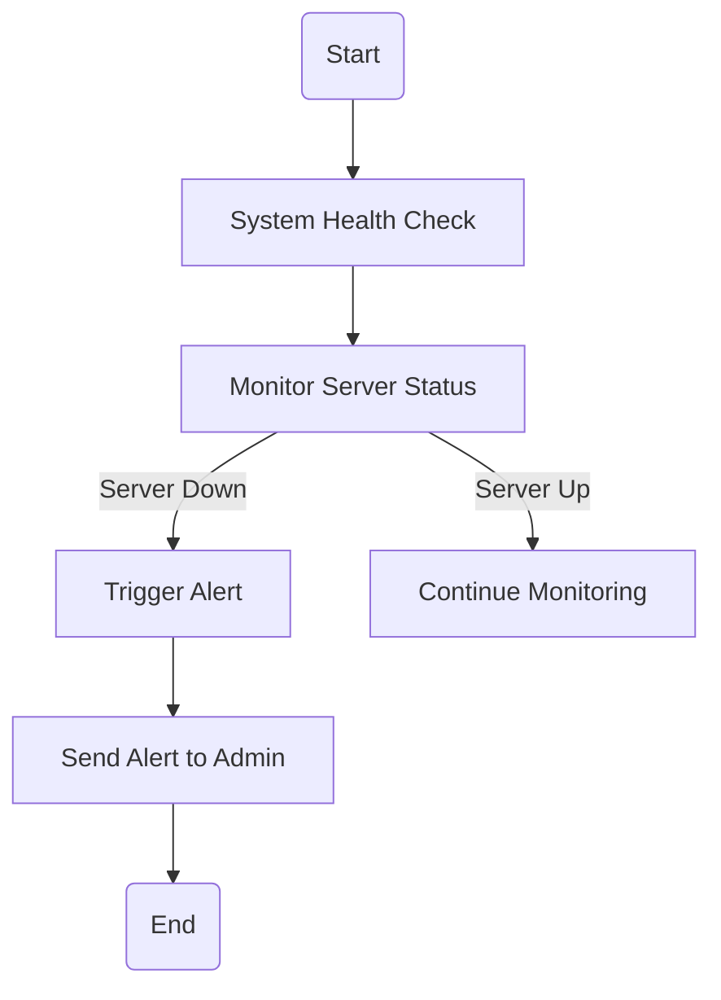

# Activity Workflow Modeling

This document contains **UML activity diagrams** for key workflows in the system, along with explanations of their process flows, decisions, and parallel actions.

## 1. User Registration

### Explanation
- **Key States & Transitions**: The process starts with user input validation, followed by account creation and email confirmation.
- **Stakeholder Concerns**: Ensures secure and error-free user registrations while preventing invalid data from entering the system.

---

## 2. Search for Events

### Explanation
- **Key States & Transitions**: Searches the database and displays events if found; otherwise, an error is shown.
- **Stakeholder Concerns**: Improves user experience by ensuring a fast and efficient search mechanism.

---

## 3. Booking an Event Ticket

### Explanation
- **Key States & Transitions**: The user selects an event, chooses tickets, proceeds to payment, and receives confirmation.
- **Stakeholder Concerns**: Ensures seamless booking and reduces errors in ticketing.

---

## 4. Payment Processing

### Explanation
- **Key States & Transitions**: Payment details are validated before processing; errors prompt users for corrections.
- **Stakeholder Concerns**: Prevents failed transactions and ensures secure payments.

---

## 5. Sending Booking Confirmation

### Explanation
- **Key States & Transitions**: After successful payment, a booking ID is generated, and a confirmation email is sent.
- **Stakeholder Concerns**: Ensures immediate feedback and avoids booking confusion.

---

## 6. Managing Event Details (Create/Edit)

### Explanation
- **Key States & Transitions**: Admins can create/edit events, ensuring valid data before saving.
- **Stakeholder Concerns**: Provides flexibility and prevents invalid event details from being saved.

---

## 7. Handling Cancellations and Refunds

### Explanation
- **Key States & Transitions**: The system checks refund eligibility before processing or notifying the user.
- **Stakeholder Concerns**: Ensures refunds follow event policies, reducing user complaints.

---

## 8. Manage User Accounts

### Explanation
- **Key States & Transitions**: Admins can update user details or deactivate accounts.
- **Stakeholder Concerns**: Enhances user management and security within the system.

---

## 9. Viewing Ticket Sales Reports

### Explanation
- **Key States & Transitions**: Admins log in, fetch ticket sales data, and generate reports.
- **Stakeholder Concerns**: Provides event organizers with critical sales insights for decision-making.

---

## 10. Monitoring System Uptime

### Explanation
- **Key States & Transitions**: The system continuously monitors uptime and alerts admins if downtime occurs.
- **Stakeholder Concerns**: Ensures real-time system reliability and performance monitoring.
