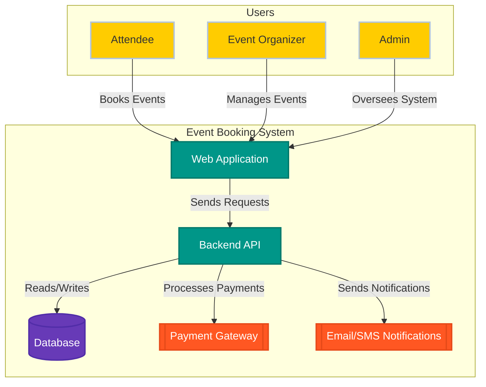
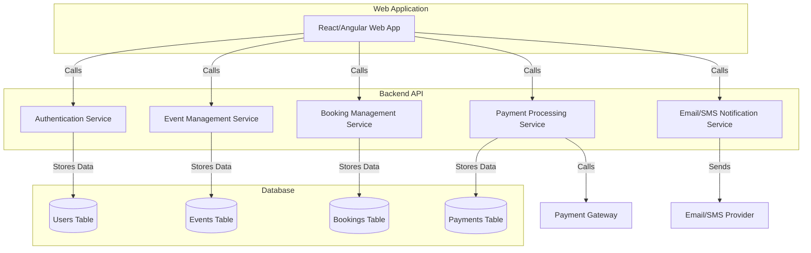
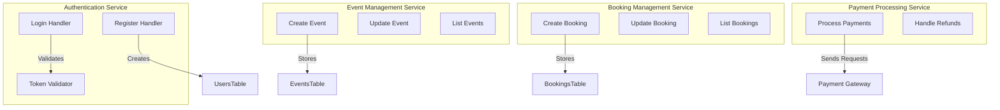
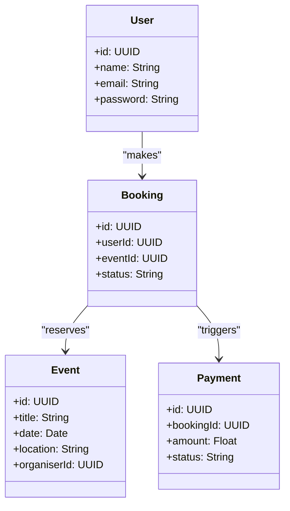

# C4 Architectural Diagrams

### Project Title
**Event Booking System (named Event Hub)**

### Domain
**Event Management**
The system operates within the **event management** domain, facilitating the organization and booking of events. It provides an online platform where users can browse events, book tickets, and manage reservations, while event organisers can create and manage event listings efficiently.

### Problem Statement
Traditional event booking methods often involve manual processes, leading to inefficiencies such as overbooking and poor reservation tracking, The **Event Booking System – Event Hub** aims to provide a centralised, automated solution that enhances the booking experience for attendees and streamlines management for event organisers.

### Individual Scope
The **Event Booking System – Event Hub** is a feasible project due to the following justifications:
- **Modular Design**: The system can be divided into key components like user authentication, event management, and payment processing.
- **Scalability**: Designed to accommodate a growing number of users and events without performance degradation.
- **Efficiency**: Reduces manual errors and enhances the booking process through automation.
- **Technology Readiness**: Can be implemented using widely available web technologies such as MySQL.
- **Market Demand**: Digital solutions for event management are increasingly popular, making this system relevant and valuable.

### C4 Model Overview
The C4 model consists of four levels of abstraction:
1. **Context Diagram** – Provides an overview of the system and its interactions with users and external systems.
2. **Container Diagram** – Breaks down the system into major containers (e.g., web application, database, external services).
3. **Component Diagram** – Presents internal components within containers, such as authentication service, booking service, and notification system.
4. **Code Diagram** – (Optional) Represents the structure of the codebase at a class/module level.

# C4 Diagrams for Event Booking System

## 1. Context Diagram (C4 Level 1)

## 2. Container Diagram (C4 Level 2)

## 3. Component Diagram (C4 Level 3)

## 4. Code Diagram (C4 Level 4) 

