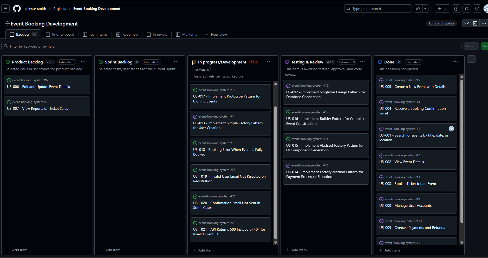

# Changelog for Assignment 12

All notable changes to this project will be documented in this file.

## [1.0.0] - 2025-05-01
### Added
- POST `/api/users` to register a new user
- GET `/api/users` to list all users
- GET `/api/events` to retrieve all events
- POST `/api/events` to create a new event
- POST `/api/bookings` to allow users to book an event
- GET `/api/bookings` to view all bookings

### Fixed
- Handled 404 error for non-existent user or event
- Prevented duplicate event bookings by same user
- Standardized error response format (JSON)

### Changed
- Improved validation for email fields in user registration

## When pushing commits
git commit -m "Fix #4: Handle booking email failure"

or for new features:
git commit -m "Close #3: Implement POST /api/bookings"

## Screenshot of updated Kanban Board

