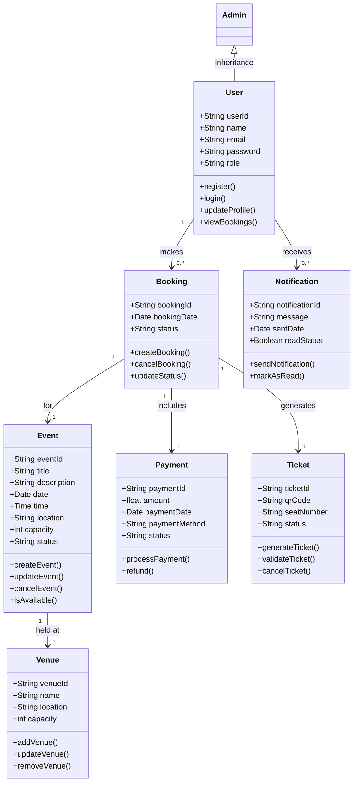

# Class Diagram – Event Booking System

##Mermaid.js UML Class Diagram

## 1. Entity Identification & Separation of Concerns
The core classes (User, Event, Booking, Payment, Ticket, Venue, Notification) were derived from prior work (requirements, use cases, and diagrams). Each class has specific responsibilities to keep the system modular, maintainable, and testable.

## 2. User Management & Role Differentiation
A single User class handles registration and login. Role-specific logic (e.g., Admin) is handled through inheritance for role-based access control.

## 3. Booking Lifecycle Logic
Booking ties the user, event, ticket, and payment to reflect real-world flow and ensure transaction traceability.

## 4. Ticket and Notification Decoupling
Ticket and Notification are decoupled from Event and Booking, allowing them to evolve independently. Notifications can be sent for multiple actions.

## 5. Relationships & Multiplicity
- One User can have many Bookings (1..*).
- A Booking is for one Event, has one Payment, and generates one Ticket.
- An Event is always at a Venue.
These relationships ensure business logic integrity, such as no orphaned bookings.

## 6. System Flexibility & Scalability
The design supports future scalability, such as adding multiple event types or supporting multi-venue events, without major refactoring.

## 7. Traceability to Prior Assignments
Each class and relationship maps directly to functional requirements (Assignment 4), use cases/user stories (Assignments 5 & 6), and activity/state models (Assignment 8).

