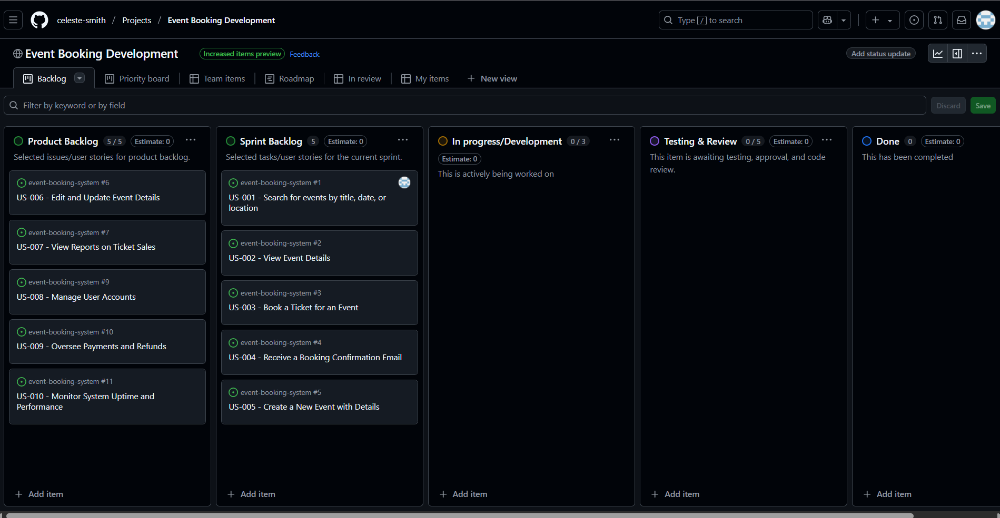

# Event Booking System – (Name of Booking System: Event Hub)

## Introduction
The **Event Booking System (Event Hub)** is a web-based platform that allows users to browse, book, and manage event tickets. It streamlines the event reservation process, providing an efficient way for users to book seats for an event. 

## Features
- **User Registration & Login** – Users can create accounts and securely log in.
- **Browse Available Events** – Users can view a list of current and upcoming events with event details.
- **Book & Cancel Tickets** – Users can reserve seats and have an option to cancel bookings if needed.
- **Payment Processing (Optional)** – Users can make secure online payments for when they purchase a ticket to an event. 
- **Admin Dashboard** – The event organisers can manage (create/update) events.

## Project Structure
This repository includes the following files:
- **`README.md`** – An overview of the project.
- **`SPECIFICATION.md`** – This file contains the system requirements and detailed specifications.
- **`ARCHITECTURE.md`** – This includes the architectural modelling and C4 diagrams.

## Links
- [System Specification](SPECIFICATION.md)
- [Architecture & C4 Diagrams](ARCHITECTURE.md)

## Technologies Used (To Be Determined)
- Frontend: (e.g., React or plain HTML/CSS/JS)
- Backend: (e.g., Python Flask, or PHP)
- Database: (e.g., MySQL)

# Event Booking Development - Kanban Board

## Overview
This Kanban board is designed to track the development process of the Event Booking System project. It helps manage tasks efficiently by organizing user stories into different stages of the development lifecycle.

## Customization Choices

### Added Columns
- **Product Backlog**: Stores user stories and tasks that are planned for future sprints.
- **Sprint Backlog**: Contains selected tasks that are part of the current sprint.
- **In Progress/Development**: Tracks tasks actively being worked on.
- **Testing & Review**: Tasks awaiting testing, approval, or code review.
- **Done**: Completed tasks that have been reviewed and approved.

### Linked Issues & Labels
- Each user story is linked to an issue from the repository.
- Issues are labeled appropriately (e.g., `feature`, `bug`) to categorize tasks effectively.

### Task Assignments
- Team members are assigned tasks using `@mentions` for clear responsibility allocation.

## Screenshot

