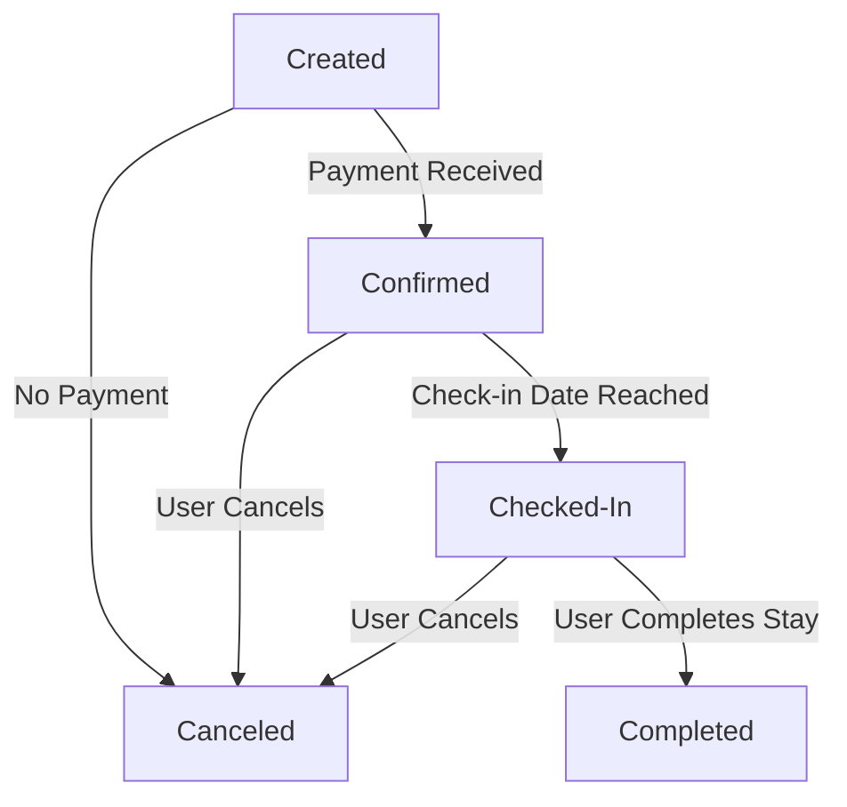
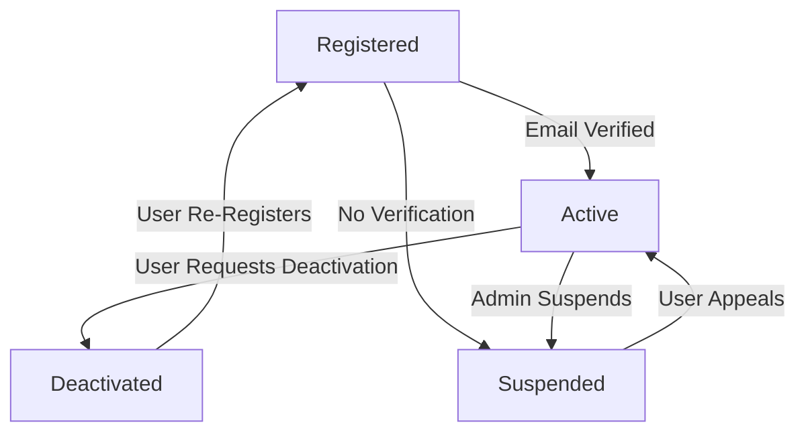
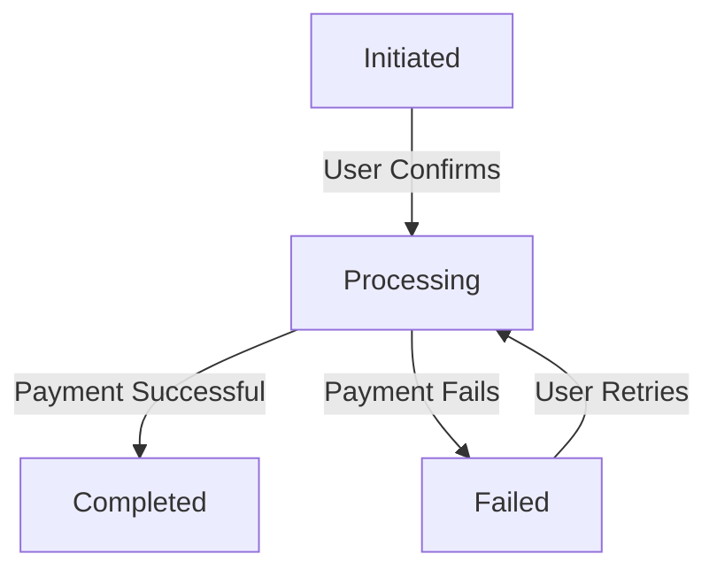
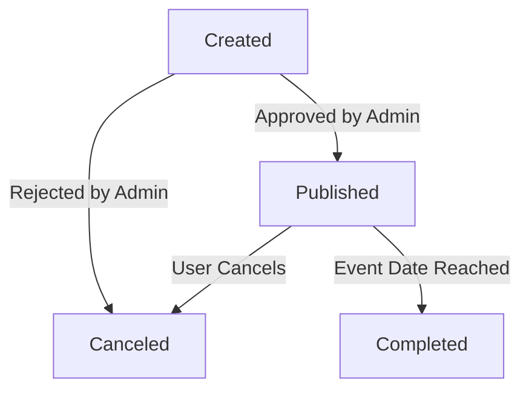
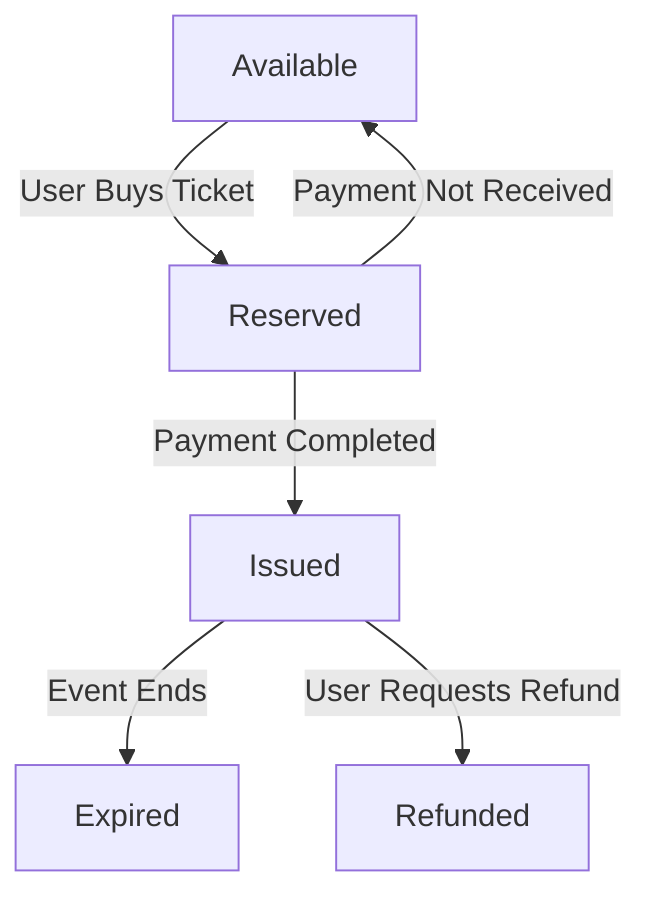
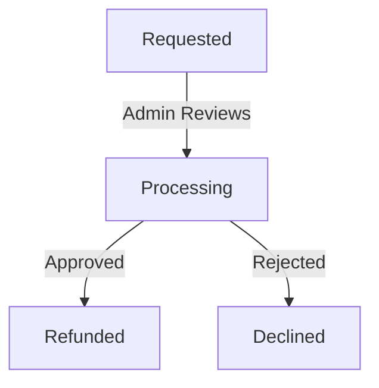

# Object State Modeling with State Transition Diagrams

## Overview
This document presents state transition diagrams for critical objects in the booking system. Each diagram highlights key states, transitions, and conditions that align with the system’s functional requirements.

## 1. **Booking Object**

### Explanation
- **Created**: The booking is made but not yet paid.
- **Confirmed**: Payment is received, and the booking is secured.
- **Checked-In**: The user arrives and checks in.
- **Completed**: The booking is successfully fulfilled.
- **Canceled**: If no payment is received or the user cancels.

## 2. **User Account Object**

### Explanation
- **Registered**: A new user signs up.
- **Active**: The user completes email verification.
- **Suspended**: The account is flagged for non-compliance.
- **Deactivated**: The user voluntarily disables their account.

## 3. **Payment Object**

### Explanation
- **Initiated**: Payment process starts.
- **Processing**: Payment is being verified.
- **Completed**: Payment is successful.
- **Failed**: The transaction fails but can be retried.

## 4. **Event Object**

### Explanation
- **Created**: A new event is submitted.
- **Published**: The event is approved and visible.
- **Canceled**: The event is removed by the user or admin.
- **Completed**: The event takes place as planned.

## 5. **Ticket Object**

### Explanation
- **Available**: Tickets are available for purchase.
- **Reserved**: The user selects a ticket but hasn’t paid yet.
- **Issued**: The ticket is purchased and valid.
- **Refunded**: The user requests a refund.
- **Expired**: The event has ended.

## 6. **Refund Object**

### Explanation
- **Requested**: The user submits a refund request.
- **Processing**: The admin is reviewing the request.
- **Refunded**: The request is approved.
- **Declined**: The refund is denied.
