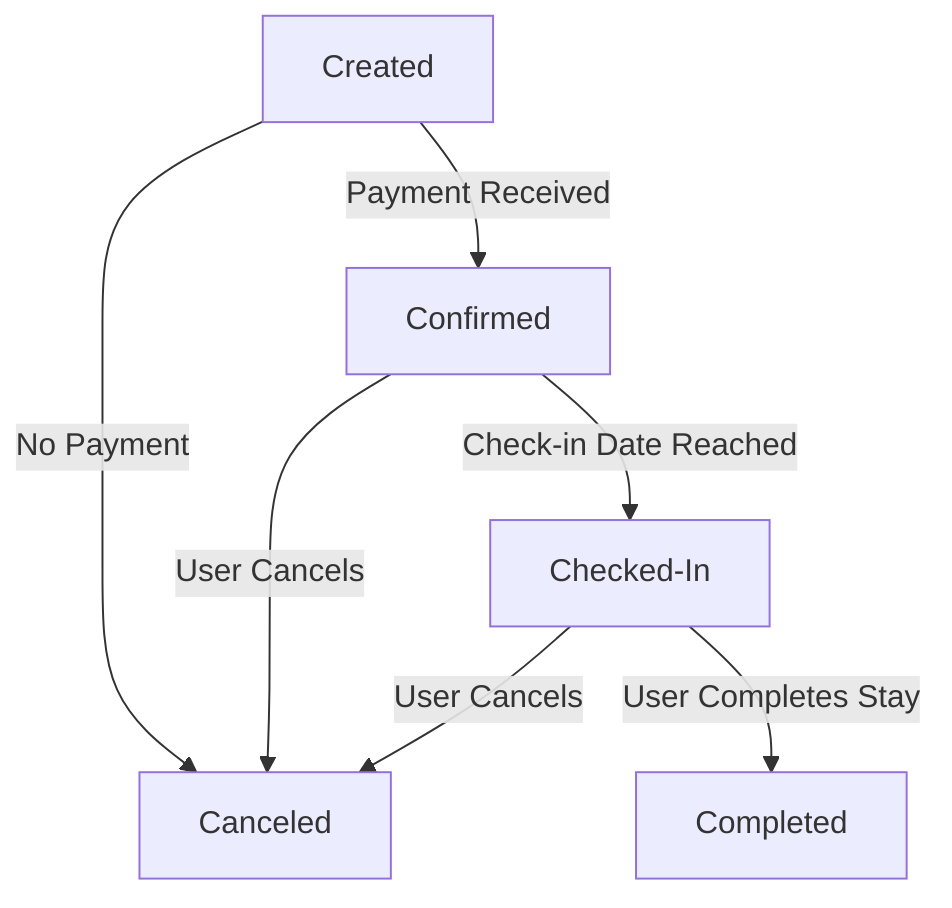
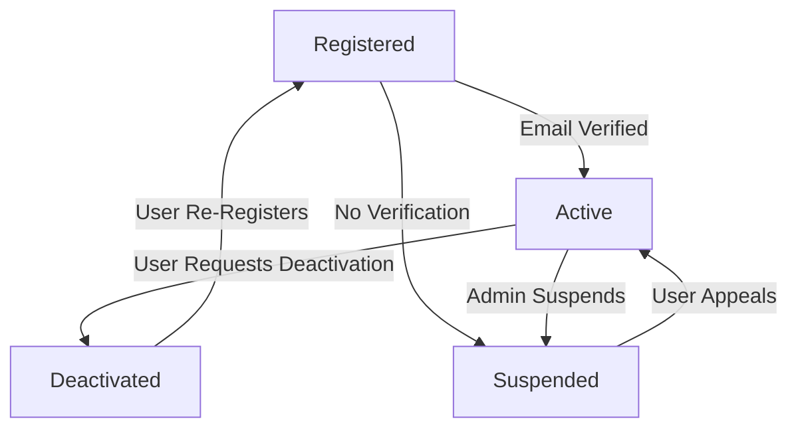
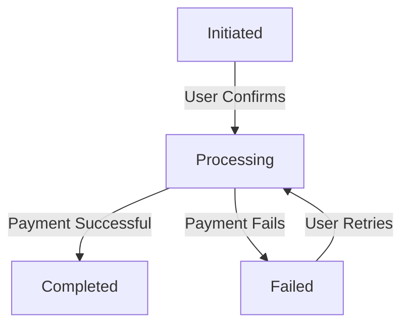
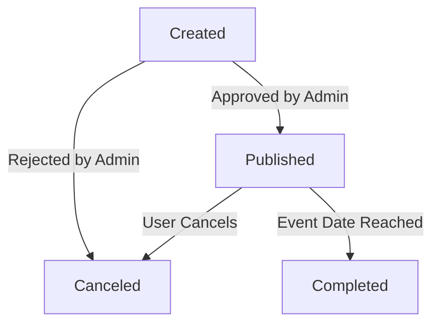
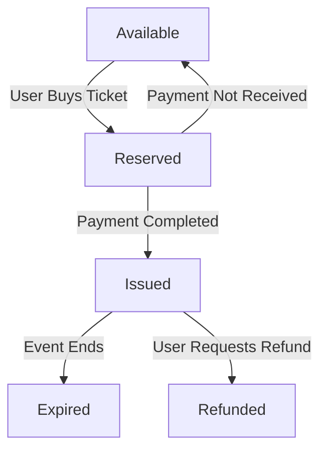
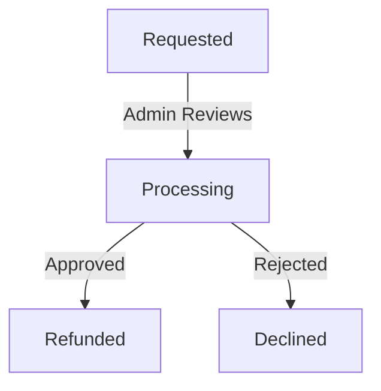

# Object State Modeling with State Transition Diagrams for Event Booking System

## Overview
This document presents state transition diagrams for critical objects in the booking system. Each diagram highlights key states, transitions, and conditions that align with the system’s functional requirements.

## 1. **Booking Object**

### Explanation
#### Key States and Transitions
- **Created** → **Confirmed**: When payment is received, the booking is confirmed.
- **Created** → **Canceled**: If payment is not made, the booking is canceled.
- **Confirmed** → **Checked-In**: The user checks in on the event date.
- **Checked-In** → **Completed**: The user completes their attendance at the event.
- **Confirmed/Checked-In** → **Canceled**: The user cancels before attending.

#### Mapping to Functional Requirements
- **FR4**: The transition from "Created" to "Confirmed" ensures that ticket bookings require successful payment.
- **FR5**: A confirmed booking triggers the generation of digital tickets.
- **FR7**: The transition from "Confirmed" to "Canceled" supports users canceling bookings before the deadline.

---
## 2. **User Account Object**

### Explanation
#### Key States and Transitions
- **Registered** → **Active**: The user verifies their email.
- **Registered** → **Suspended**: If verification is not completed, the account is suspended.
- **Active** → **Deactivated**: Users can deactivate their own accounts.
- **Active** → **Suspended**: Admin can suspend accounts for violations.
- **Suspended** → **Active**: If a user appeals successfully, the account is restored.

#### Mapping to Functional Requirements
- **FR2**: The transition from "Registered" to "Active" ensures users verify emails before accessing system features.
- **FR10**: The system enforces role-based access control through active/suspended states.

---
## 3. **Payment Object**

### Explanation
#### Key States and Transitions
- **Initiated** → **Processing**: The payment process starts when the user confirms payment.
- **Processing** → **Completed**: A successful payment transaction completes the process.
- **Processing** → **Failed**: If payment fails, the transaction moves to "Failed."
- **Failed** → **Processing**: Users can retry payment.

#### Mapping to Functional Requirements
- **FR4**: The transition from "Processing" to "Completed" ensures that only paid bookings are confirmed.

---
## 4. **Event Object**

### Explanation
#### Key States and Transitions
- **Created** → **Published**: An event is approved by an admin and becomes available.
- **Created** → **Canceled**: An event is rejected or removed.
- **Published** → **Completed**: The event date is reached, and the event is completed.
- **Published** → **Canceled**: The event organizer cancels the event.

#### Mapping to Functional Requirements
- **FR3**: Organizers can manage their events and update details before booking closes.
- **FR8**: Admins have the authority to approve or reject event submissions.

---
## 5. **Ticket Object**

### Explanation
#### Key States and Transitions
- **Available** → **Reserved**: A user selects a ticket but hasn’t completed payment.
- **Reserved** → **Issued**: When payment is received, the ticket is issued.
- **Reserved** → **Available**: If payment is not received, the ticket is released.
- **Issued** → **Expired**: The ticket expires after the event ends.
- **Issued** → **Refunded**: A user requests a refund and it is processed.

#### Mapping to Functional Requirements
- **FR4**: Ticket reservation and issuance ensure online booking and payment processing.
- **FR5**: Issued tickets contain QR codes for verification.
- **FR7**: The system supports ticket cancellation and refunding before the event.

---
## 6. **Refund Object**

### Explanation
#### Key States and Transitions
- **Requested** → **Processing**: A refund request is under review.
- **Processing** → **Refunded**: If approved, the refund is issued.
- **Processing** → **Declined**: If rejected, the refund is denied.

#### Mapping to Functional Requirements
- **FR7**: Users can cancel bookings and request refunds, which the admin processes based on event policies.
