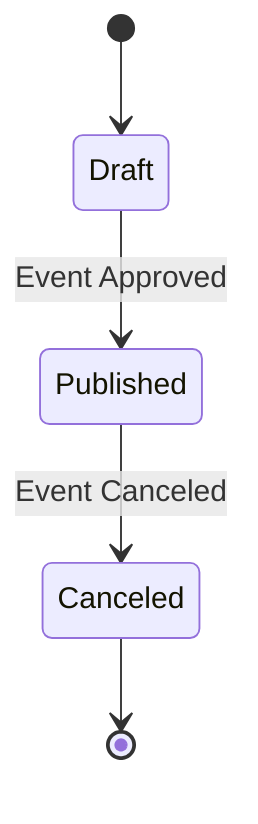
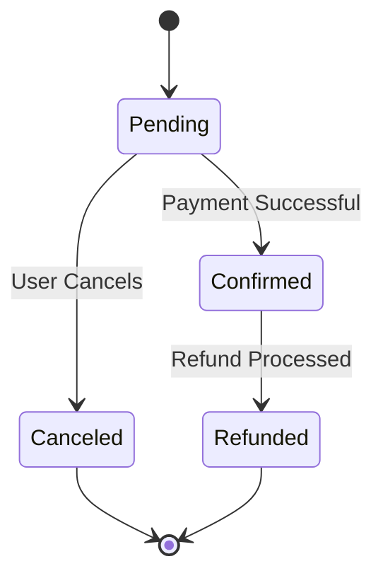

# Object State Modeling with State Transition Diagrams
## 1. State Transition Diagrams

### **Event Lifecycle**

**Explanation:**
- The `Event` object moves from `Draft` to `Published` once approved.
- If canceled, it transitions to the `Canceled` state, ensuring event visibility aligns with system rules.

### **Booking Lifecycle**

**Explanation:**
- A `Booking` starts as `Pending` and moves to `Confirmed` after payment.
- Users can cancel their booking, transitioning to `Canceled`.
- If eligible, a refund moves the booking to `Refunded`.

---
