# Use Case Modeling for Event Booking System (EventHub)

## Use Case Diagram

```mermaid
graph TD;
    A[Event User] -->|Search| B[Search Events];
    A -->|Register| C[Create Account];
    A -->|Book| D[Book Event];
    A -->|View| E[View Booking Details];
    A -->|Cancel| F[Cancel Booking];
    
    G[Event Organiser] -->|Create| H[Create Event];
    G -->|Edit| I[Edit Event];
    G -->|Manage| J[Manage Bookings];
    
    K[Admin] -->|Approve| L[Approve Events];
    K -->|Monitor| M[Monitor System];
    K -->|Handle| N[Manage Users];

    %% Styling
    style A fill:#16C5B7,stroke:#16C5B7,stroke-width:2px,font-size:14px;
    style G fill:#FFA500,stroke:#FFA500,stroke-width:2px,font-size:14px;
    style K fill:#00407a,stroke:#00407a,stroke-width:2px,font-size:14px;

    style B fill:#16C5B7,stroke:#16C5B7;
    style C fill:#16C5B7,stroke:#16C5B7;
    style D fill:#16C5B7,stroke:#16C5B7;
    style E fill:#16C5B7,stroke:#16C5B7;
    style F fill:#16C5B7,stroke:#16C5B7;

    style H fill:#FFA500,stroke:#FFA500;
    style I fill:#FFA500,stroke:#FFA500;
    style J fill:#FFA500,stroke:#FFA500;

    style L fill:#00407a,stroke:#00407a;
    style M fill:#00407a,stroke:#00407a;
    style N fill:#00407a,stroke:#00407a;
```

## Explanation of Key Actors and Use Cases

### Actors:
1. **Event User** - This is a customer who searches, books, views, and cancels events.
2. **Event Organiser** - This is a person or organisation responsible for creating, editing, and managing event bookings.
3. **Admin** - This would be a system administrator responsible for approving events, monitoring the system, and managing users.

### Relationships Between Actors and Use Cases:
- **Generalisation:** An administrator can also manage users and has more rights than an event organiser.
- **Inclusion:** "Manage Bookings" includes both "Approve Events" and "Monitor System."
- **Extension:** "Cancel Booking" extends "View Booking Details" since users can only cancel after viewing their bookings.

### Addressing Stakeholder Concerns:
- **Users:** Reduces manual labour by enabling smooth event booking and searching
- **Event Organisers:** Allows for improved event management and customer engagement.
- **Admins:** Ensures system control, security, and proper event approval.
